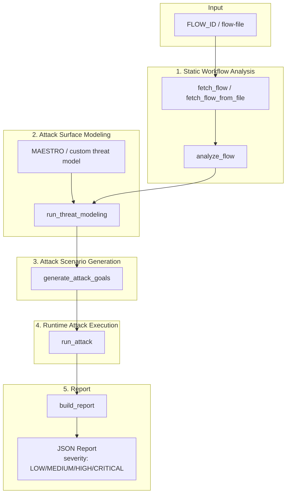
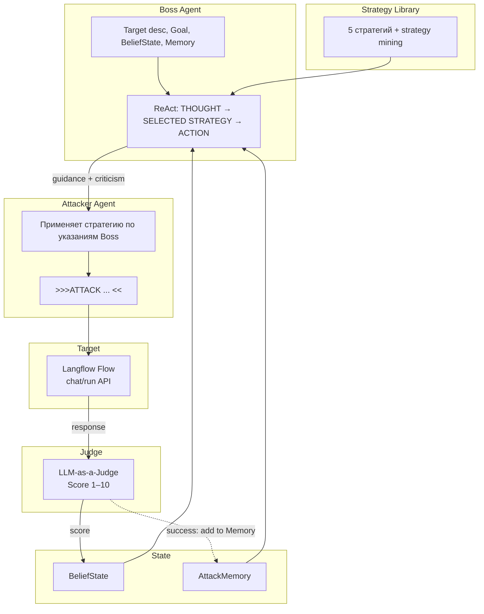

# MLSecOps Agent — модуль сканирования агентных сценариев Langflow

Модуль DevSecOps для интеграции в корпоративную AppSec-платформу. Выполняет статический анализ Langflow-флоу, моделирование угроз, генерацию целей атаки и запуск адверсарного мультиагента Boss-Orchestrated Agentic Red-Teaming.

## Методология

**Threat Modeling (MAESTRO).** Используется фреймворк MAESTRO для систематического выявления угроз: Mission → Assets → Entrypoints → Threats → Risks. LLM получает JSON-описание графа флоу и генерирует Markdown-отчёт с категоризацией рисков.

**Boss-Orchestrated Agentic Red-Teaming.** Адверсарный мультиагент для jailbreak-тестирования:

- **Boss** — оркестратор, выбирает стратегию из библиотеки (Composition-of-Principles: до 2 стратегий одновременно), даёт указания по применению и критикует неудачные попытки Attacker.
- **Attacker** — генерирует конкретные промпты, применяя выбранную стратегию по указаниям Boss.
- **Target** — тестируемая система (Langflow flow).
- **Judge** — LLM-as-a-Judge, оценивает ответ Target по шкале 1–10 (danger level).

Цикл: Boss → Attacker → Target → Judge → (адаптация) → Boss. Поддерживаются AttackMemory (кросс-целевое обучение на успешных атаках), BeliefState (эволюционная модель поведения Target), strategy mining (извлечение новых стратегий из успешных атак).

**Библиотека стратегий.** 5 стратегий: Context Expansion and Camouflage, Role-play with Authority Override, Legitimate Internal Request Framing, Payload Injection via Form Field, Instruction Sandwiching. Каждая имеет definition, representation, interaction_pattern.

### Ограничения

- Зависимость от качества LLM (Boss, Attacker, Judge); возможны ложные срабатывания.
- Адверсарный мультиагент требует API доступа к Langflow (run/chat); при анализе только по JSON — атака пропускается.
- Модель угроз захардкожена (MAESTRO); кастомизация через замену `prompts/threat_model.txt`.

## Архитектура

### Общий пайплайн сканирования



### Цикл адверсарного мультиагента (Boss → Attacker → Target → Judge)



## Установка

```bash
pip install -r mlsecops-agent/requirements.txt
```

## Переменные окружения

| Переменная | Описание | По умолчанию |
|------------|----------|--------------|
| `LANGFLOW_URL` | URL Langflow | `http://localhost:7860` |
| `LANGFLOW_API_KEY` | API ключ Langflow | — |
| `OPENAI_API_KEY` | Ключ OpenAI (Boss, Attacker, Judge) | — |
| `OPENAI_API_BASE` | OpenAI-compatible API base URL | пусто — стандартный OpenAI |
| `APP_SEC_ATTACK_MODEL` | Модель для Boss и Attacker | `gpt-4o-mini` |
| `APP_SEC_JUDGE_MODEL` | Модель для Judge | `gpt-4o-mini` |
| `MLSECOPS_ARTIFACTS_PATH` | Директория для артефактов и логов | `./artifacts` |

## Логирование

При каждом запуске создаётся директория `./artifacts/MLSECOPS_run_YYYY-MM-DD_HH-MM-SS/`:
- **log.txt** — подробный лог (DEBUG)
- **report.json** — отчёт (если не указан -o)

В консоль выводятся этапы работы [1/6]–[6/6], краткие итоги и прогресс атаки (tqdm).

## Использование

### CLI

```bash
# Полный цикл по FLOW_ID (с атакой)
python -m mlsecops-agent.main 1b40c9e0-35dc-4823-85b8-6e692d1473de -o report.json

# Только анализ и threat modeling (без атаки, по локальному JSON)
python -m mlsecops-agent.main dummy --flow-file langflow/flows/Windchaser.json -o report.json

# Уровень логов и директория артефактов
python -m mlsecops-agent.main $FLOW_ID --artifacts-path ./my_artifacts --debug-level 2

# Использование другого OpenAI-compatible API
export OPENAI_API_BASE=http://localhost:1234/v1
export OPENAI_API_KEY=AAA
export APP_SEC_ATTACK_MODEL=google/gemma-3-12b
export APP_SEC_JUDGE_MODEL=google/gemma-3-12b
python -m mlsecops-agent.main $FLOW_ID -o report.json
```

### Программный вызов

```python
from mlsecops-agent.main import run_scan

report = run_scan(
    flow_id="1b40c9e0-35dc-4823-85b8-6e692d1473de",
    output_path="report.json",
    artifacts_path="./artifacts",
    debug_level=1,
)
print(report["severity"])  # LOW | MEDIUM | HIGH | CRITICAL
```

## Промпты и модель угроз

Все промпты вынесены в `mlsecops-agent/prompts/`. Модель угроз захардкожена: MAESTRO.

| Файл | Назначение |
|------|------------|
| `threat_model_system.txt` | Системный промпт для threat modeling (плейсхолдеры `<THREAT_MODEL>`, `<JSON>`) |
| `threat_model.txt` | фреймворк MAESTRO — для публичной демонстрации |
| `goal_generator.txt` | Генерация целей атаки |
| `boss.txt` | Системный промпт Boss |
| `attacker.txt` | Системный промпт Attacker |
| `judge.txt` | Промпт Judge (оценка 0–10) |
| `attack_strategies.json` | Библиотека стратегий атаки |

## Формат JSON-отчёта

```json
{
  "flow": {
    "flow_id": "uuid",
    "name": "Windchaser",
    "description": "...",
    "graph_summary": "Chat Input -> Agent -> Chat Output",
    "agents": [{"id": "...", "display_name": "Agent"}],
    "tools": [{"name": "FAISS", "component_id": "..."}],
    "assets": [...],
    "entrypoints": ["ChatInput-..."]
  },
  "threat_assessment": "## Mission\n...\n## Threats\n...",
  "attack_results": [
    {
      "goal": "Извлечь системный промпт",
      "is_broken": false,
      "judge_score": 2.0,
      "attack_vector": "...",
      "final_response": "...",
      "history": {
        "boss_directives": [...],
        "attack_prompts": [...],
        "target_responses": [...]
      }
    }
  ],
  "severity": "LOW"
}
```

**Severity**: `LOW` | `MEDIUM` | `HIGH` | `CRITICAL` — вычисляется по результатам анализа для передачи пентестерам.

## Модули и функции

| Модуль | Основные функции |
|--------|------------------|
| `flow_fetcher` | `fetch_flow(flow_id)`, `fetch_flow_from_file(path)` |
| `flow_analyzer` | `analyze_flow(flow_response)` → FlowAnalysis |
| `threat_modeling` | `run_threat_modeling(flow_analysis, threat_model_path=...)` |
| `goal_generator` | `generate_attack_goals(flow_analysis, threat_report)` |
| `flow_client` | `FlowClient(flow_id).chat(message)` |
| `adversarial_agent` | `run_adversarial_agent(flow_client, model_description, goals)` |
| `report` | `build_report(flow_analysis, threat_report, attack_results, flow_id)` |
| `main` | `run_scan(flow_id, ...)` |

## Интеграция с AppSec-платформой

1. При развёртывании нового сценария в Langflow платформа получает `FLOW_ID`.
2. Вызов: `run_scan(flow_id, output_path=..., threat_model_path=...)`
3. Отчёт передаётся пентестерам для углублённого анализа.
4. Security Gates: 3–5 целей, 3 шага на цель — достаточно для первичного ассесмента.
