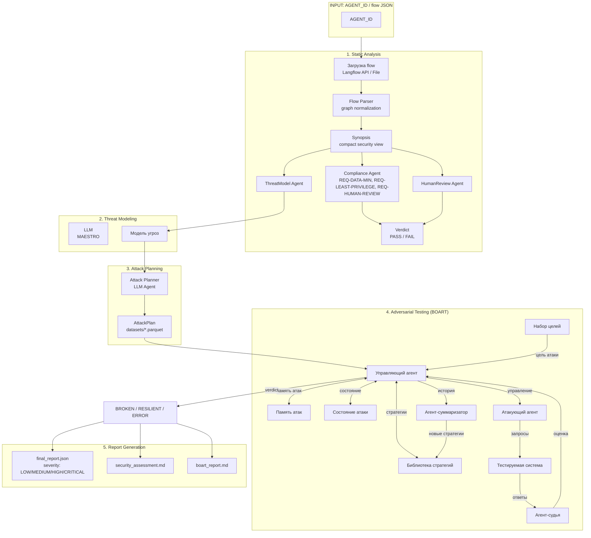

# Langflow Security Gate Validator

Пайплайн автоматизированного security-аудита и состязательного тестирования агентных диалоговых систем, построенных в Langflow.

## Архитектура пайплайна



## Этапы выполнения

### Stage 1: Static Analysis (Security Gate)

| Шаг | Описание |
|-----|----------|
| **Fetch** | Загрузка flow из Langflow REST API или локального JSON-файла |
| **Parse** | Нормализация JSON в `FlowGraph` — узлы, рёбра, entrypoints, controls |
| **Synopsis** | Построение компактного security-synopsis для LLM-агентов |
| **ThreatModelAgent** | Генерация модели угроз по корпоративной таксономии MAESTRO |
| **ComplianceAgent** | Проверка 3 требований: `REQ-DATA-MIN`, `REQ-LEAST-PRIVILEGE`, `REQ-HUMAN-REVIEW` + статические проверки литеральных секретов |
| **HumanReviewAgent** | Формирование сигналов для ручной экспертной проверки |
| **Verdict** | Итоговый вердикт `PASS`/`FAIL` |

### Stage 2: Threat Modeling

Моделирование угроз с использованием методологии MAESTRO или корпоративной модели угроз. LLM-агент анализирует архитектуру и выявляет поверхности атаки.

### Stage 3: Attack Planning

LLM-агент выбирает релевантные датасеты атак (`datasets/*.parquet`) на основе:
- Synopsis flow
- Модели угроз (threat model markdown)
- Результатов compliance check

### Stage 4: Adversarial Testing (BOART)

Состязательное тестирование через черный ящик Langflow API:
1. LLM генерирует атакующий промпт из датасета
2. Отправка в target endpoint (`POST /api/v1/run/{flow_id}`)
3. LLM-judge оценивает ответ цели
4. Score (1-10) → Вердикт `BROKEN` / `RESILIENT` / `ERROR`
5. Метрика ASR (Attack Success Rate)

### Stage 5: Report Generation

- `final_report.json` — структурированный отчёт с severity (LOW / MEDIUM / HIGH / CRITICAL)
- `security_assessment.md` — сводный документ для тикета
- `security_gate.md` — отчёт Security Gate
- `boart_report.md` — результаты состязательного тестирования

---

## Входные данные

### CLI-аргументы

| Параметр | Описание | Обязательно |
|----------|----------|-------------|
| `--flow-id` | ID flow в Langflow | Да (без `--flow-file`) |
| `--url` | URL Langflow API | Нет |
| `--flow-file`, `-f` | Путь к локальному JSON-файлу | Да (альтернатива `--flow-id`) |
| `--openai-base-url` | OpenAI-compatible API URL | Нет |
| `--openai-model` | Модель LLM | Нет |
| `--output-dir`, `-o` | Директория для артефактов | Нет |
| `--no-ssl-verify` | Отключить проверку TLS | Нет |
| `-v`, `--verbose` | DEBUG-логирование | Нет |
| `--target-endpoint` | Прямой endpoint для BOART | Нет |

### Переменные среды

| Переменная | Описание | По умолчанию |
|------------|----------|--------------|
| `LANGFLOW_URL` | URL Langflow API | `http://localhost:7860` |
| `FLOW_ID` | ID flow | — |
| `LANGFLOW_API_KEY` | API-ключ Langflow | — |
| `LANGFLOW_SSL_VERIFY` | Проверка TLS для Langflow | `true` |
| `OPENAI_BASE_URL` | OpenAI-compatible API URL | — |
| `OPENAI_SSL_VERIFY` | Проверка TLS для OpenAI | `true` |
| `VALIDATOR_SSL_VERIFY` | Глобальная проверка TLS | `true` |
| `VALIDATOR_OUTPUT_DIR` | Директория артефактов | — |
| `VALIDATOR_LOG_LEVEL` | Уровень логирования | `INFO` |
| `VALIDATOR_TARGET_TIMEOUT` | Таймаут для target (BOART) | `300` сек |

---

## Выходные данные

### Security Gate Report

```python
{
    "flow_id": str,
    "langflow_url": str,
    "verdict": {
        "status": "PASS" | "FAIL",
        "comment": str
    },
    "compliance": {
        "REQ-DATA-MIN": {"status": str, "rationale": str, "evidence": list},
        "REQ-LEAST-PRIVILEGE": {"status": str, "rationale": str, "evidence": list},
        "REQ-HUMAN-REVIEW": {"status": str, "rationale": str, "evidence": list}
    },
    "artifacts_dir": str | None
}
```

### BOART Report

```python
{
    "summary": {
        "goals_total": int,
        "broken": int,
        "resilient": int,
        "errors": int,
        "asr": float  # Attack Success Rate
    },
    "results": [
        {
            "attack_name": str,
            "goal": str,
            "verdict": "BROKEN" | "RESILIENT" | "ERROR",
            "max_score": float,
            "steps": [...]
        }
    ]
}
```

### Final Report

```python
{
    "system": {"flow_path": str, "assets": [...], "controls": [...]},
    "threat_model": {"report_markdown": str},
    "adversarial_testing": {
        "attack_plan": {...},
        "summary": {...},
        "goals": [...],
        "raw_report": {...}
    },
    "compliance": {
        "requirements_checked": int,
        "violations": int,
        "warnings": int,
        "overall": "PASS" | "FAIL" | "WARN",
        "results": [...]
    },
    "risk": {
        "per_threat_severity": [
            {
                "threat": str,
                "severity": "LOW" | "MEDIUM" | "HIGH" | "CRITICAL",
                "max_score": float
            }
        ],
        "severity_scale": ["LOW", "MEDIUM", "HIGH", "CRITICAL"]
    }
}
```

### Артефакты в директории прогона

| Файл | Описание |
|------|----------|
| `final_report.json` | Полный структурированный отчёт |
| `security_assessment.md` | Сводный документ для тикета |
| `security_gate.md` | Отчёт Security Gate (Markdown) |
| `compliance_report.json` | Результаты REQ-* проверок |
| `boart_report.json` | Результаты BOART |
| `boart_report.md` | Markdown-версия BOART |
| `attack_plan.json` | План атак и обоснование |
| `threat_model.md` | Модель угроз |
| `synopsis.json` | Security-synopsis графа |
| `system_prompts.json` | Извлечённые system prompts |
